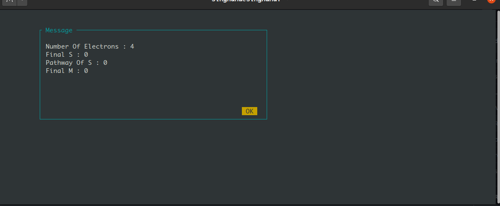
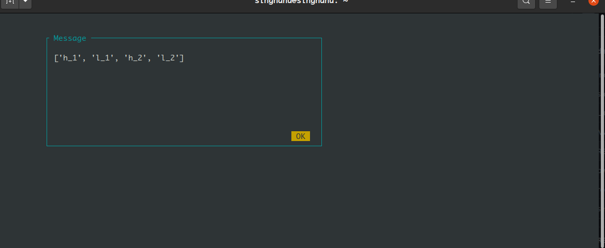
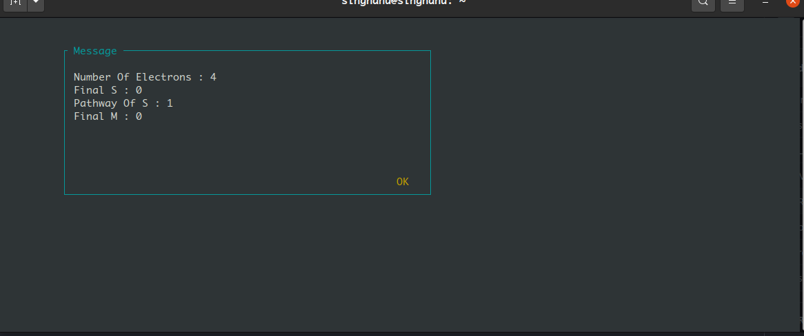
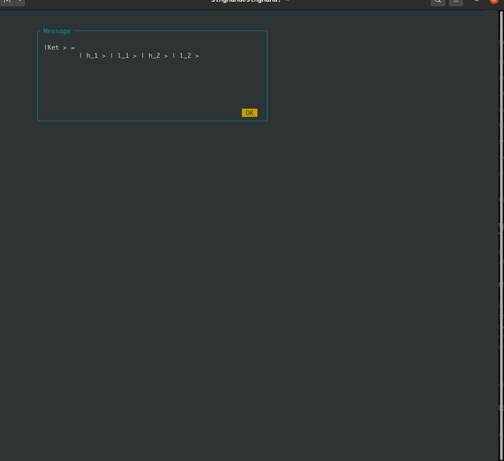

SymbolicCI
----------
The program generate Configuration Interaction wavefunction and Hamiltonian expression for an arbitrary multiplicity and for 
a given number of electron.

-----------
Description
-----------
This program the generate the configurations state function using branching diagram for a given spin state based on $S^{2}$ and $S_{z}$ with a specific spin configuration of it's subsystem using branching diagram. The program allow the configuration of electrons to be distributed in set of spatial orbital/site. Based on the spin and site of electron it generate the qbit operator using pauli matrix for creation and annhilation of electron. Then it evaluates the coupling 
$$\\langle \\Psi \\vert H \\vert\\Phi\\rangle =  \\substack{\\langle C_{s_{1},a_{1}} \\otimes...\\otimes C_{s_{n},a_{n}} \\vert \\mathbf{O_{1}}\\vert C^{\\dagger}_{s_{1},a_{1}}\\otimes...\\otimes C^{\\dagger}_{s_{n},a_{n}} \\rangle  \\\\ + \\frac{1}{2} \\langle C_{s_{1},a_{1}} \\otimes...\\otimes C_{s_{n},a_{n}} \\vert \\mathbf{O_{2}}\\vert C^{\\dagger}_{s_{1},a_{1}}\\otimes...\\otimes C^{\\dagger}_{s_{n},a_{n}} \\rangle } $$
from the derived electronic configuration of state using symbolic python.

------------
Installation
------------

.. code-block:: bash

     pip install git+https://github.com/roehr-lab/SymbolicCI.git

-----
Run
-----
To evaluate the coupling expression use program SymbolicCI-Coupling.py
.. code-block:: bash

     SymbolicCI-Coupling.py

Before running the coupling program it is advised to visit https://roehr-lab.github.io/im1.html to explore the spin chain configuration you want to evaluate.

.. image:: images/i10.png
    :height: 850px
    :width: 1000px

.. image:: images/i11.png
    :height: 850px
    :width: 1000px

.. image:: images/i1.png
    :height: 450px
    :width: 1000px

.. image:: images/i4.png
    :height: 450px
    :width: 1000px

.. image:: images/i6.png
    :height: 750px
    :width: 1000px

.. image:: images/i7.png
    :height: 750px
    :width: 1000px

.. image:: images/i9.png
    :height: 450px
    :width: 1000px

.. image:: images/i12.png
    :height: 950px
    :width: 1000px

------------
Requirements
------------

Required python packages:

 * pytorch
 * numpy, scipy, matplotlib
 * sympy
 * pip 10+

------
Author
------
* Anurag Singh

---------
Reference
---------
