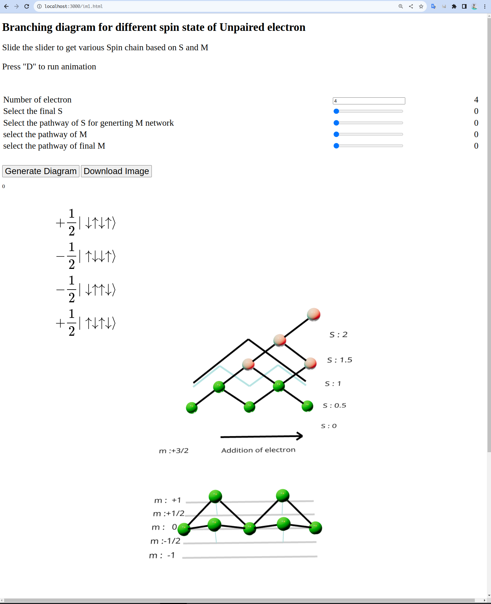

SymbolicCI
----------
The program generate Configuration Interaction wavefunction and expression of couplings and dibatic energy in terms of one electron and two electron integral expressions for an arbitrary multiplicity and for a given number of electrons. With this program used can not only choose the multiplicity of the whole system but also the muliplicities of the subsystem and their order as well as the sign of mutual interactions. 

-----------
Description
-----------
This program the generate the configurations state function using branching diagram for a given spin state based on $S^{2}$ and $S_{z}$ with a specific spin configuration of it's subsystem using branching diagram. The program allow the configuration of electrons to be distributed in set of spatial orbital/site. Based on the spin and site of electron it generate the qbit operator using pauli matrix for creation and annhilation of electron. Then it evaluates the coupling 
$$\\langle \\Psi \\vert H \\vert\\Phi\\rangle =  \\substack{\\langle C_{s_{1},a_{1}} \\otimes...\\otimes C_{s_{n},a_{n}} \\vert \\mathbf{O_{1}}\\vert C^{\\dagger}_{s_{1},a_{1}}\\otimes...\\otimes C^{\\dagger}_{s_{n},a_{n}} \\rangle  \\\\ + \\frac{1}{2} \\langle C_{s_{1},a_{1}} \\otimes...\\otimes C_{s_{n},a_{n}} \\vert \\mathbf{O_{2}}\\vert C^{\\dagger}_{s_{1},a_{1}}\\otimes...\\otimes C^{\\dagger}_{s_{n},a_{n}} \\rangle } $$
from the derived electronic configuration of state using symbolic python.

------------
Installation
------------

.. code-block:: bash

     pip install git+https://github.com/roehr-lab/SymbolicCI.git

-----
Run
-----
To evaluate the coupling expression use program SymbolicCI-Coupling.py

.. code-block:: bash

     SymbolicCI-Coupling.py

Before running the coupling program it is advised to visit https://roehr-lab.github.io/im1.html to explore the spin chain configuration you want to evaluate. You can enter the number of electrons that is desired in your system and slide the sliders of "final S", "Pathway of S" and  "Final M". The website will show the constructed many electron spin state. 
An example of evaluation of coupling between the states $\\langle S_{1}S_{0} \\vert  H \\vert ^{1}T T \\rangle$ is shown here. Please note-down the value of "final S", "Pathway of S" and  "Final M" for the desired Bra and Ket. 

This is the branching diagram of two singlet subsystem combination giving Singlet. This will serve the spin configuration for $S_{0}S_{1}$ 

.. image:: images/i11.png
    :height: 850px
    :width: 1000px

This is the branching diagram of two triplet subsystem combination giving Singlet. This will serve the spin configuration for $^{1}TT$ 

.. image:: images/i1.png
    :height: 450px
    :width: 1000px

After selecting the spin configuration for the Bra and Ket of the wave function the spatial orbital for each electron is selected.

.. image:: images/i6.png
    :height: 750px
    :width: 1000px

.. image:: images/i7.png
    :height: 750px
    :width: 1000px

After the selection of spatial orbitals  is complete the program iterate overall the determinants of bra, kets , one electron symbolic operator and two electron symbolic operators during the  evaluation process.

.. image:: images/i9.png
    :height: 450px
    :width: 1000px

The coupling terms are printed out. (Note that example coupling has two electron integrals  only. So no One electron integral terms are printed)

This package also contains script to calculate the couplings among all the state  over all singlet mulitplicity of the slipped stack trimer system by slipping along longitudnal(x) and transvesal(y) axis. The states include local exciton, charge transfer states, paired triplets with singlet multiplicity. 

.. code-block:: bash

     TrimerCalculate.sh ethene.xyz 0.7 0.0

The script run program SymbolicCI-TrimerCoupling.py and SymbolicCI-TrimerPlot.py consecutively. SymbolicCI-TrimerCoupling.py uses the three command line arguments (1) xyz file of monomer (2) slipped stacking along x  in angstrom (2) slipped stacking along y  in angstrom , contruct trimer and peform initial electronic structure calculation and transformation of integrals. SymbolicCI-TrimerPlot.py calculates the dibatic coupling and energy plot the couplings. 
------------
Requirements
------------

Required python packages:

 * pytorch
 * numpy, scipy, matplotlib
 * sympy
 * pip 10+
 * pyscf

------
Author
------
* Anurag Singh

---------
Reference
---------
